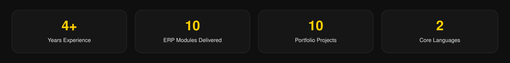

  
  

 

I build the **backend** and design the **database**. When the project includes a dashboard or admin panel, the interface design is mine too.

Laravel, Vue.js, MySQL — **4+ years** turning business requirements into working systems.

---

### What I build in every project

My role is clearly defined: backend engineering and database architecture. On projects with an admin dashboard, the UI/UX is mine as well.

<table>
<tr>
<td width="33%" valign="top">

#### Backend
Laravel APIs, business logic, authentication, role-based access, multi-module ERP, Eloquent, queues, and cron jobs.

</td>
<td width="33%" valign="top">

#### Database
MySQL schema design from scratch, relational modelling, migrations, query optimisation, reporting, and data integrity.

</td>
<td width="33%" valign="top">

#### UI / UX
Admin dashboards and client interfaces — from Figma wireframes to a finished, usable screen.

</td>
</tr>
</table>

---

### Where I've worked

**CamelCase Company** · Full-Stack Developer, ERP Division  
2021 — Present

- Built and maintained a large-scale ERP across **10+ modules**: manufacturing, catalog, logistics, sales, HR, warehouse, promotions, CRM, compliance, and supplier evaluation
- Designed MySQL schemas and REST APIs used by Vue.js and mobile apps
- Designed admin dashboards in Figma, then worked with the frontend team to ship them
- Integrated payment gateways, shipping providers, and external ERP connectors
- Optimised complex SQL — report generation **~60% faster**

**Freelance** · Full-Stack Developer & Vue.js  
Independent projects

- Delivered end-to-end systems: inventory, school, rent, transport, restaurant, and e-commerce
- For each project: database schema, Laravel backend, and dashboard UI
- Designed mobile UI kits in Figma (HR, pharmacy, learning, tasks, retail)

---

### Featured on GitHub

- **[SmartFlow](https://github.com/LinaAhmadGhojan/smart-flow)** — Laravel + Vue 3 operations platform (admin, products, categories)
- **[Wasla Store](https://github.com/LinaAhmadGhojan/wasla-store)** — E-commerce built with Laravel
- **[Volunteer Management](https://github.com/LinaAhmadGhojan/ManagementVolunteer)** — PHP volunteer management system
- **[E-commerce Vue](https://github.com/LinaAhmadGhojan/ecommerce-vue)** — Vue.js storefront UI

More screenshots and case work: [portfolio](https://atlasdev.tech/lina-ahmad-ghojan/index.html)

---

### Skills & tools

---

### Let's work together

Open to **backend and full-stack roles**, ERP projects, and Vue.js collaborations.  
I reply within 24 hours.

- Email: [eng.lina.ghojan@gmail.com](mailto:eng.lina.ghojan@gmail.com)
- WhatsApp: [+963 995 019 487](https://wa.me/963995019487)
- Portfolio: [lina ahmad ghojan](https://atlasdev.tech/lina-ahmad-ghojan/index.html)

   
  Damascus · Remote · Arabic & English

