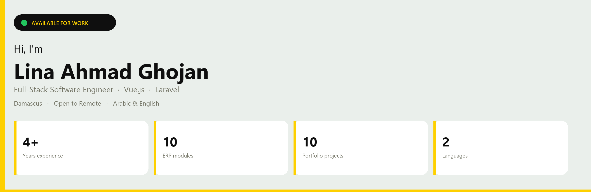

  

 

I build the **backend** and the **database**. If the product has an admin dashboard, I design that too — from Figma to a working Laravel + Vue system.

**Now:** Full-Stack Developer, ERP · CamelCase · 2021–Present  
**Open to:** Backend / full-stack roles · ERP · Remote

  <a href="mailto:eng.lina.ghojan@gmail.com">Email</a> ·
  <a href="https://wa.me/963995019487">WhatsApp</a> ·
  <a href="https://atlasdev.tech/lina-ahmad-ghojan/index.html">Portfolio</a> ·
  <a href="https://github.com/LinaAhmadGhojan">GitHub</a>

---

### Stack

  

---

### Selected work

<table>
  <tr>
    <td width="50%"></td>
    <td width="50%"></td>
  </tr>
  <tr>
    <td width="50%"></td>
    <td width="50%"></td>
  </tr>
</table>

 

| Project | What I did | Code |
| --- | --- | --- |
| **SmartFlow** | Laravel + Vue 3 operations platform — admin, products, categories | [repo](https://github.com/LinaAhmadGhojan/smart-flow) |
| **Wasla Store** | E-commerce backend and store flows in Laravel | [repo](https://github.com/LinaAhmadGhojan/wasla-store) |
| **Volunteer Management** | PHP system for volunteer operations | [repo](https://github.com/LinaAhmadGhojan/ManagementVolunteer) |
| **E-commerce Vue** | Vue.js storefront UI | [repo](https://github.com/LinaAhmadGhojan/ecommerce-vue) |

---

### Experience

**CamelCase — Full-Stack Developer, ERP** · 2021–Present  
10+ modules (manufacturing, sales, HR, warehouse, CRM, logistics). MySQL schemas, REST APIs for Vue and mobile, Figma dashboards, payment/shipping integrations. Cut heavy report queries by ~60%.

**Freelance — Full-stack & Vue**  
Inventory, school, rent, transport, restaurant, and e-commerce systems: schema → Laravel API → dashboard UI. Mobile UI kits in Figma.

---

  <strong>Let’s work together</strong> 
  Backend, full-stack, and ERP roles · I reply within 24 hours 
  <a href="mailto:eng.lina.ghojan@gmail.com">eng.lina.ghojan@gmail.com</a>
  ·
  <a href="https://wa.me/963995019487">+963 995 019 487</a>

